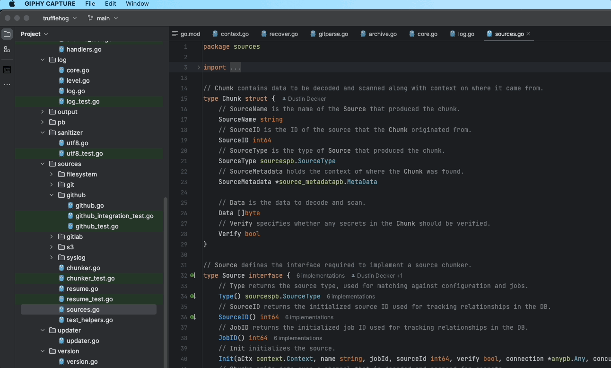
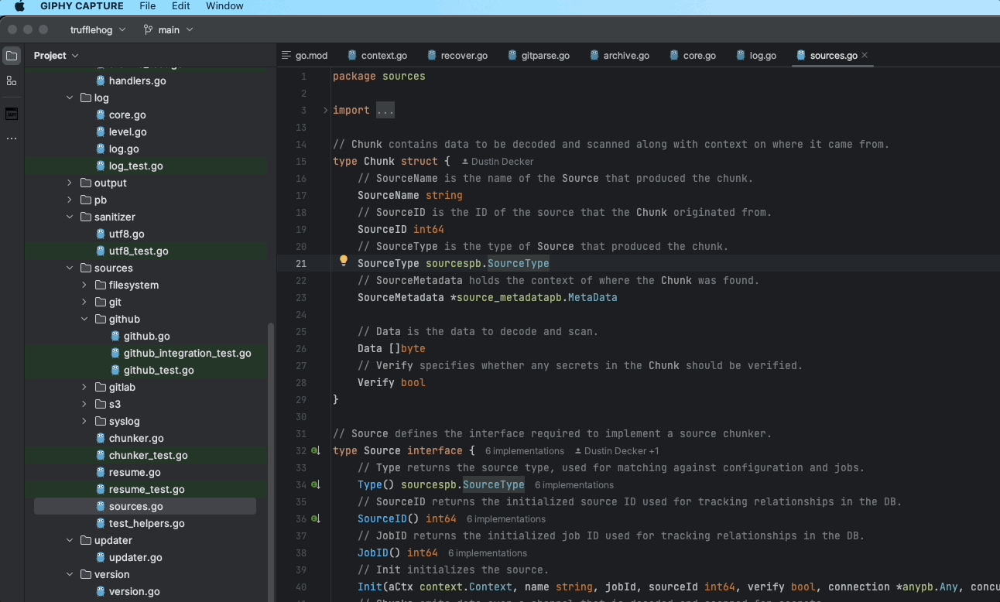
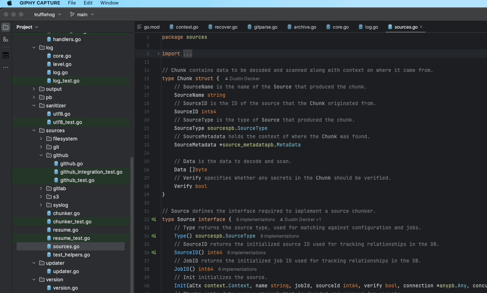

# MC Path
<!-- Plugin description -->
This plugin was made only for one purpose: My friend MC need this :)
<!-- Plugin description end -->

## Installation
1. Inside your IDE, select Preferences -> Plugins.
2. Search for MC path.
3. Click the green "Install" button.
4. Re-launch your IDE.

## How it works

You can run formatting manually from contextual menu:

From tools menu:

Or using keyboard shortcut <kbd>Ctrl Shift L</kbd> on PC and <kbd>⌘ ⇧ L</kbd> on Mac
